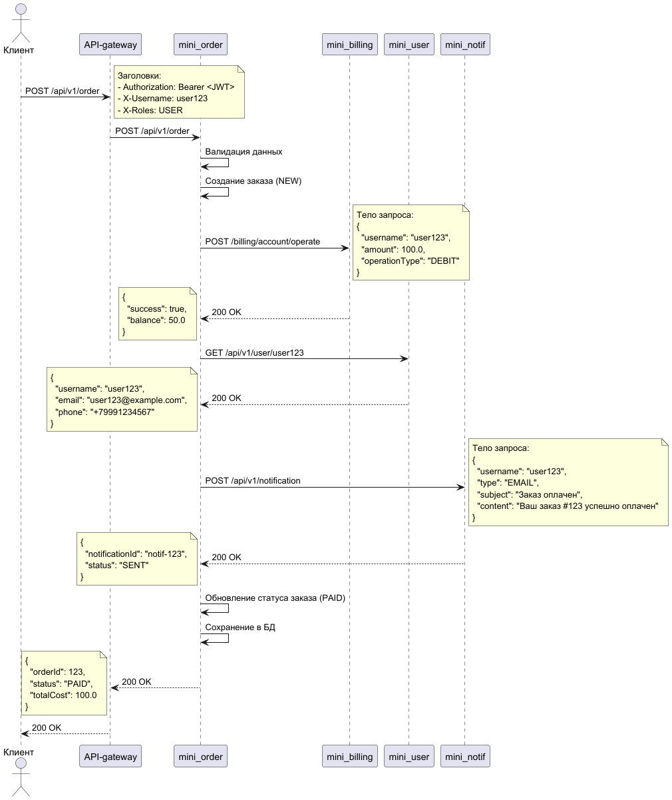

# ADR: Синхронное взаимодействие сервисов при создании заказов

## Контекст
При создании заказа в системе необходимо организовать взаимодействие между микросервисами. Требуется определить архитектуру с исключительно синхронным взаимодействием через HTTP-вызовы.

## Решение
Будет использована полностью синхронная архитектура с HTTP-вызовами между всеми сервисами. Взаимодействие будет происходить по следующему сценарию:

### Создание заказа (полностью синхронный процесс)

1. Клиент отправляет POST запрос на создание заказа через API-gateway
2. API-gateway проверяет JWT токен и добавляет заголовки X-Username и X-Roles
3. Запрос направляется в сервис заказов (mini_order)
4. Сервис заказов:
   - Валидирует входные данные
   - Создает заказ со статусом "NEW"
   - Синхронно вызывает сервис биллинга для списания средств
   - При успешной оплате:
     - Синхронно вызывает сервис профилей для получения контактных данных пользователя
     - Синхронно вызывает сервис уведомлений для отправки уведомления
     - Обновляет статус заказа на "PAID"
   - При неудачной оплате:
     - Обновляет статус заказа на "INSUFFICIENT_FUNDS"
   - Сохраняет заказ в базу данных
   - Возвращает клиенту ответ с результатом операции

### Обработка новых пользователей

1. При регистрации нового пользователя, сервис авторизации (mini_auth):
   - Создает пользователя
   - Синхронно вызывает сервис профилей для создания профиля
   - Синхронно вызывает сервис биллинга для создания счета

### Sequence диаграмма
   

### Описание API
[Описание API](idl/0001_sync.md)

## HTTP Endpoints

| Сервис | Метод | Путь | Описание |
|--------|-------|------|----------|
| mini_order | POST | /api/v1/order | Создание заказа |
| mini_billing | POST | /billing/account/operate | Операция со счетом (оплата) |
| mini_user | GET | /api/v1/user/{username} | Получение профиля пользователя |
| mini_user | POST | /api/v1/user | Создание профиля пользователя |
| mini_notif | POST | /api/v1/notification | Создание и отправка уведомления |

## Преимущества
- **Простота отладки**: Полный стек вызовов виден в одном request-response цикле
- **Предсказуемость**: Последовательное выполнение операций, легче понимать порядок действий
- **Синхронный ответ**: Клиент получает полный результат операции сразу
- **Упрощенное управление транзакциями**: Логика отката изменений централизована в одном сервисе

## Недостатки
- **Повышенная задержка**: Общее время ответа равно сумме времени всех последовательных вызовов
- **Высокая связанность**: Все сервисы должны быть доступны для успешного завершения операции
- **Риск домино-эффекта**: Сбой одного сервиса приводит к неудаче всей операции
- **Ограниченная масштабируемость**: Нельзя независимо масштабировать обработку уведомлений
- **Блокировка ресурсов**: Долгие операции уведомлений блокируют создание заказов

## Механизмы улучшения надежности
- Внедрение таймаутов для всех HTTP-вызовов
- Реализация механизма повторных попыток с экспоненциальной задержкой
- Добавление кеширования для часто запрашиваемых данных
- Внедрение circuit breaker паттерна для защиты от cascading failures
- Реализация идемпотентности для всех операций
- Добавление детального логирования и distributed tracing