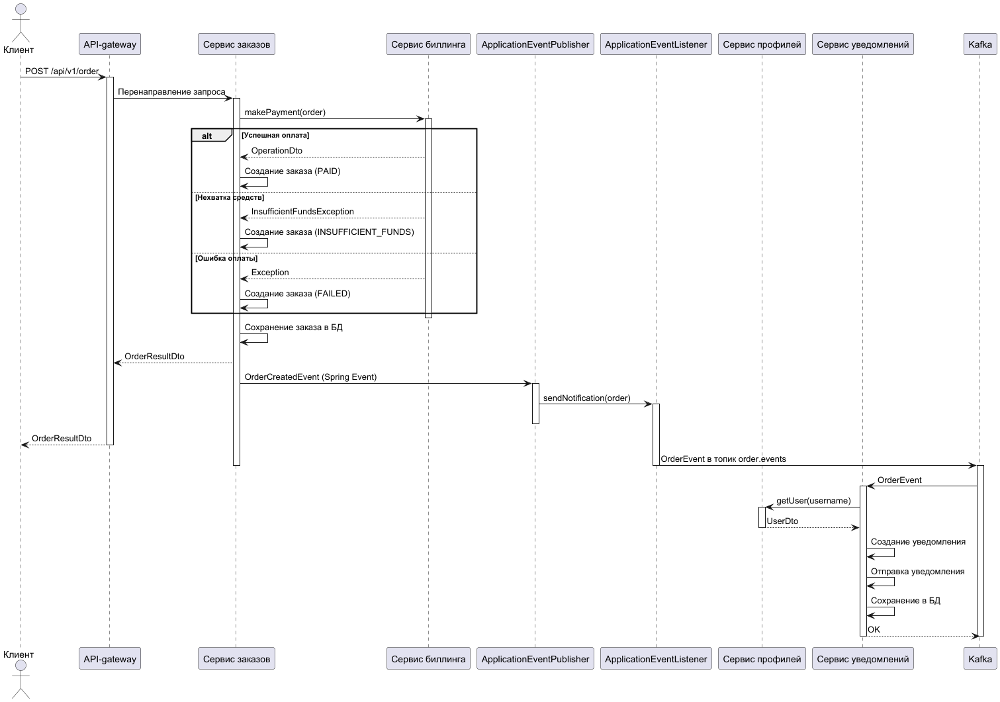

# ADR: Событийное взаимодействие cервисов с использование брокера сообщений для нотификаций при создании заказов

## Контекст
При создании заказа в системе необходимо организовать взаимодействие между несколькими микросервисами:

- API-gateway - точка входа для всех клиентских запросов
- Сервис авторизации (mini_auth) - управление аутентификацией и авторизацией
- Сервис профилей пользователей (mini_user) - хранение и управление профилями пользователей
- Сервис биллинга (mini_billing) - обработка платежей и управление счетами
- Сервис уведомлений (mini_notif) - отправка уведомлений пользователям
- Сервис заказов (mini_order) - управление жизненным циклом заказов

Требуется определить архитектуру взаимодействия, которая обеспечит надежность, масштабируемость и отказоустойчивость системы.

## Решение
Будет использована гибридная архитектура с комбинацией синхронных HTTP-вызовов и асинхронного взаимодействия через Kafka. Взаимодействие между сервисами будет происходить по следующему сценарию:

### 1. Создание заказа (синхронная часть)

1. Клиент отправляет POST запрос на создание заказа через API-gateway
2. API-gateway проверяет JWT токен в заголовке Authorization и добавляет в запрос заголовки X-Username и X-Roles
3. Запрос направляется в сервис заказов (mini_order)
4. Сервис заказов:
   - Валидирует входные данные
   - Создает заказ со статусом "NEW"
   - Синхронно вызывает сервис биллинга через REST API для списания средств
   - Обновляет статус заказа на "PAID" при успешной оплате или "INSUFFICIENT_FUNDS" при нехватке средств
   - Сохраняет заказ в базу данных
   - Возвращает клиенту ответ с результатом операции

### 2. Уведомление пользователя (асинхронная часть)

1. После сохранения заказа в базу данных, сервис заказов публикует событие `OrderCreatedEvent` через Spring ApplicationEventPublisher
2. `OrderNotificationListener` в сервисе заказов обрабатывает это событие после успешного коммита транзакции
3. `NotificationServiceImpl` создает сообщение `OrderEvent` и публикует его в топик Kafka `order.events`
4. Сервис уведомлений (mini_notif) подписан на топик `order.events`
5. При получении события, сервис уведомлений:
   - Извлекает контактные данные пользователя из сервиса профилей (mini_user)
   - Определяет тип уведомления на основе статуса заказа
   - Сохраняет уведомление в своей базе данных
   - Отправляет уведомление пользователю выбранным способом (email, SMS и т.д.)

### 3. Обработка новых пользователей

1. При регистрации нового пользователя, сервис авторизации (mini_auth) создает пользователя и синхронно вызывает сервис профилей (mini_user) для создания профиля
2. Сервис профилей публикует событие `UserCreatedEvent`
3. Сервис биллинга подписан на это событие и автоматически создает счет для нового пользователя

### Sequence диаграмма
  

## Схема данных

### OrderEvent (Kafka message)

```json
class OrderEvent {
  String username;
  Long orderId;
  Double totalCost;
  String status;
  NotificationContact contact;
  NotificationType notificationType;
  Long parentId;
}
```

### HTTP Endpoints

| Сервис | Метод | Путь | Описание |
|--------|-------|------|----------|
| mini_order | POST | /api/v1/order | Создание заказа |
| mini_billing | POST | /billing/account/operate | Операция со счетом (оплата) |
| mini_user | GET | /api/v1/user/{username} | Получение профиля пользователя |
| mini_notif | POST | /api/v1/notification | Создание уведомления |

## Преимущества
- **Надежность**: Критические операции (оплата) выполняются синхронно с подтверждением
- **Отказоустойчивость**: Некритичные операции (уведомления) выполняются асинхронно через Kafka
- **Масштабируемость**: Каждый сервис можно масштабировать независимо
- **Гибкость**: Легко добавлять новые сервисы, реагирующие на события заказов
- **Упрощенная отладка**: Синхронные вызовы проще отлаживать по сравнению с полностью асинхронной архитектурой

## Недостатки
- **Блокирующие вызовы**: Синхронный вызов сервиса биллинга может замедлить создание заказа
- **Жесткая связность**: Сервис заказов напрямую зависит от сервиса биллинга
- **Отсутствие идемпотентности**: Нет механизма повторных попыток при временных сбоях

## Решение недостатков
- Внедрение механизма повторных попыток (retry) при неудачных вызовах сервиса биллинга
- Добавление таймаутов для HTTP-вызовов между сервисами
- Внедрение кеширования для часто запрашиваемых данных (профили пользователей)
- Реализация механизма идемпотентности для операций создания заказа
- Добавление мониторинга и алертинга для критических сценариев