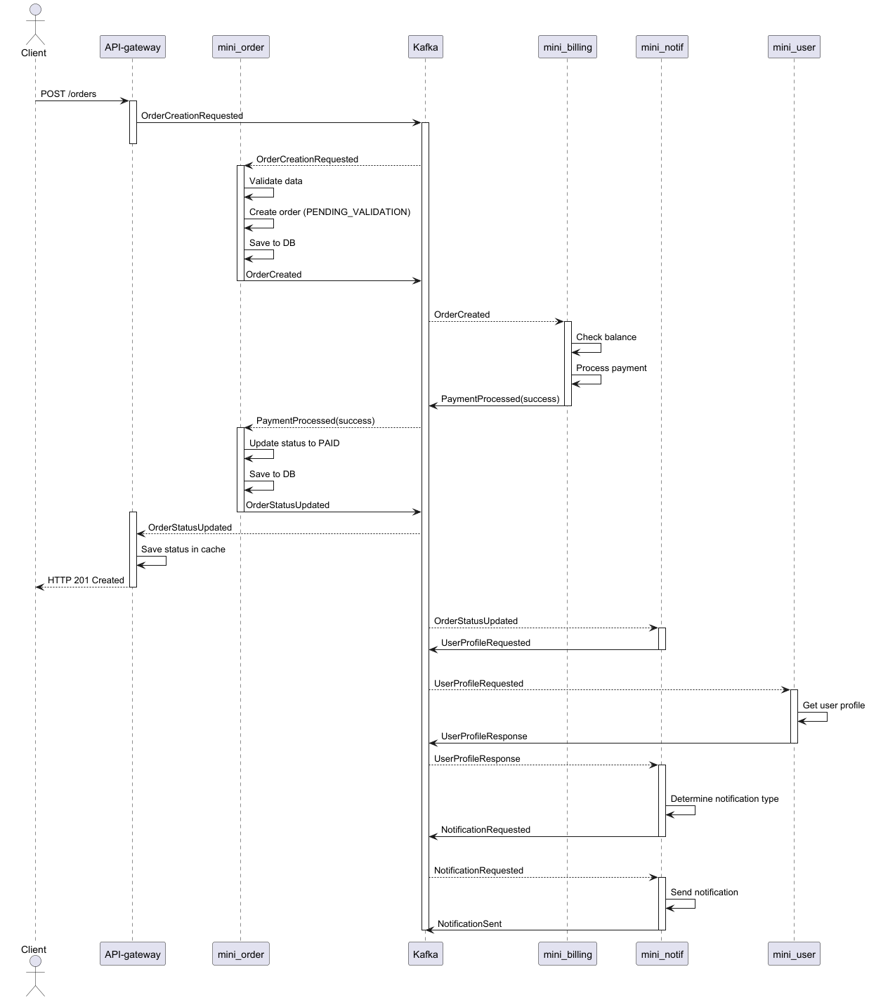

# ADR: Полностью асинхронное Event Collaboration взаимодействие сервисов с использованием брокера сообщений

## Контекст
При создании заказа в системе необходимо организовать взаимодействие между микросервисами. Требуется определить полностью асинхронную архитектуру с использованием брокера сообщений (Kafka) для всех взаимодействий между сервисами.

## Решение
Будет использована полностью асинхронная архитектура Event Collaboration с использованием брокера сообщений Kafka для всех взаимодействий между сервисами. Все операции будут выполняться через публикацию и подписку на события.

### 1. Создание заказа (полностью асинхронный процесс)

1. Клиент отправляет POST запрос на создание заказа через API-gateway
2. API-gateway проверяет JWT токен в заголовке Authorization и добавляет в запрос заголовки X-Username и X-Roles
3. API-gateway публикует событие `OrderCreationRequested` в топик Kafka `orders.requests`
4. Сервис заказов (mini_order) подписан на топик `orders.requests`
5. При получении события, сервис заказов:
   - Валидирует входные данные
   - Создает заказ со статусом "PENDING_VALIDATION"
   - Сохраняет заказ в базу данных
   - Публикует событие `OrderCreated` в топик `orders.created`
6. Сервис биллинга (mini_billing) подписан на топик `orders.created`
7. При получении события, сервис биллинга:
   - Проверяет баланс пользователя
   - Выполняет списание средств
   - Публикует событие `PaymentProcessed` в топик `billing.payments`
     - При успешной оплате: `success = true`
     - При нехватке средств: `success = false`
8. Сервис заказов подписан на топик `billing.payments`
9. При получении события `PaymentProcessed`:
   - Обновляет статус заказа на "PAID" (при успехе) или "INSUFFICIENT_FUNDS" (при неудаче)
   - Сохраняет обновленный заказ в базу данных
   - Публикует событие `OrderStatusUpdated` в топик `orders.status`
10. API-gateway подписан на топик `orders.status`
11. При получении события `OrderStatusUpdated`, API-gateway:
    - Сохраняет статус в кеше (например, Redis)
    - Завершает HTTP-запрос с соответствующим ответом клиенту

### 2. Уведомление пользователя (асинхронная часть)

1. Сервис заказов публикует событие `OrderStatusUpdated` в топик `orders.status`
2. Сервис уведомлений (mini_notif) подписан на топик `orders.status`
3. При получении события, сервис уведомлений:
   - Извлекает контактные данные пользователя из сервиса профилей (mini_user) через топик `users.profile`
   - Определяет тип уведомления на основе статуса заказа
   - Публикует событие `NotificationRequested` в топик `notifications.requested`
4. Сервис отправки уведомлений подписан на топик `notifications.requested`
5. При получении события, сервис отправки уведомлений:
   - Отправляет уведомление пользователю выбранным способом
   - Сохраняет результат отправки в своей базе данных
   - Публикует событие `NotificationSent` в топик `notifications.sent`

### 3. Обработка новых пользователей

1. При регистрации нового пользователя, сервис авторизации (mini_auth) создает пользователя
2. Сервис авторизации публикует событие `UserRegistered` в топик `users.registered`
3. Сервис профилей (mini_user) подписан на топик `users.registered` и создает профиль пользователя
4. Сервис биллинга (mini_billing) подписан на топик `users.registered` и создает счет для нового пользователя

### Sequence диаграмма
  

## Схема данных

### Описание API
[Описание API](idl/0003_async.md)

### OrderCreationRequested (Kafka message)

```json
class OrderCreationRequested {
  String requestId;
  String username;
  List<OrderItem> items;
  String deliveryAddress;
  String paymentMethod;
  Long createdAt;
}
```

### OrderCreated (Kafka message)

```json
class OrderCreated {
  String requestId;
  String username;
  Long orderId;
  List<OrderItem> items;
  Double totalCost;
  Long createdAt;
}
```

### PaymentProcessed (Kafka message)

```json
class PaymentProcessed {
  String requestId;
  Long orderId;
  String username;
  Double amount;
  Boolean success;
  String failureReason;
  Long processedAt;
}
```

### OrderStatusUpdated (Kafka message)

```json
class OrderStatusUpdated {
  String requestId;
  Long orderId;
  String username;
  String status;
  String previousStatus;
  Long updatedAt;
  Map<String, Object> metadata;
}
```

### NotificationRequested (Kafka message)

```json
class NotificationRequested {
  String notificationId;
  String requestId;
  String username;
  NotificationType type;
  String subject;
  String content;
  Map<String, String> metadata;
  Long scheduledAt;
}
```

### UserRegistered (Kafka message)

```json
class UserRegistered {
  String username;
  String email;
  Long registeredAt;
  String source;
}
```

## Топики Kafka

| Топик | Описание | Производитель | Потребитель |
|-------|----------|-------------|-----------|
| orders.requests | Запрос на создание заказа | API-gateway | mini_order |
| orders.created | Событие о создании заказа | mini_order | mini_billing |
| billing.payments | Результат обработки платежа | mini_billing | mini_order |
| orders.status | Обновление статуса заказа | mini_order | API-gateway, mini_notif |
| notifications.requested | Запрос на отправку уведомления | mini_notif | mini_notif (sender) |
| notifications.sent | Уведомление отправлено | mini_notif (sender) | (мониторинг) |
| users.registered | Регистрация нового пользователя | mini_auth | mini_user, mini_billing |
| users.profile | Запрос профиля пользователя | mini_notif | mini_user |
| users.profile.response | Ответ с профилем пользователя | mini_user | mini_notif |

## Преимущества
- **Максимальная отказоустойчивость**: Сбои одного сервиса не блокируют работу других
- **Высокая масштабируемость**: Каждый сервис можно масштабировать независимо
- **Гибкость и расширяемость**: Легко добавлять новые сервисы, реагирующие на события
- **Буферизация нагрузки**: Kafka выступает как буфер при пиковых нагрузках
- **Надежность доставки**: Kafka гарантирует доставку сообщений
- **Повторные попытки**: Автоматические retry при временных сбоях
- **Декуплирование**: Полное разделение сервисов, нет прямых зависимостей

## Недостатки
- **Сложность разработки и отладки**: Требуется отслеживание жизненного цикла событий
- **Задержка ответа клиенту**: Клиент получает ответ с задержкой
- **Сложность управления состоянием**: Нужно отслеживать корреляцию событий (requestId)
- **Сложность тестирования**: Требуется тестирование сценариев с различной очередностью событий
- **Дополнительная инфраструктура**: Требуется поддержка и мониторинг брокера сообщений
- **Сложность обеспечения согласованности**: Нужны механизмы для обеспечения конечной согласованности

## Механизмы улучшения надежности
- Внедрение корреляции запросов через `requestId` для отслеживания жизненного цикла заказа
- Реализация механизма повторных попыток с экспоненциальной задержкой для потребителей Kafka
- Добавление dead letter queue (DLQ) для сообщений, которые не удалось обработать
- Внедрение мониторинга потребления сообщений (lag, throughput)
- Реализация идемпотентности обработчиков событий
- Добавление distributed tracing для отслеживания жизненного цикла событий
- Внедрение таймаутов для ожидания ответов (например, ожидание платежа не более 30 секунд)
- Реализация шаблона SAGA для управления распределенными транзакциями

## Сравнение с предыдущими архитектурами
Полностью асинхронная архитектура Event Collaboration обеспечивает максимальную отказоустойчивость и масштабируемость по сравнению со всеми предыдущими архитектурами, но требует более сложной инфраструктуры для отладки и мониторинга. По сравнению с гибридной архитектурой, данное решение полностью устраняет синхронные зависимости между сервисами, что повышает общую устойчивость системы к сбоям.